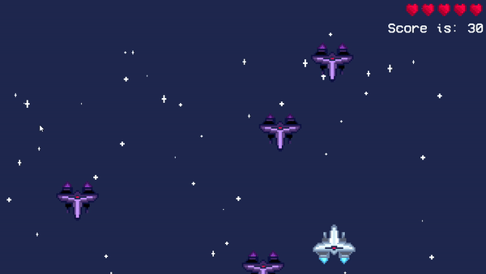

# Space Game

Welcome to Space Game, a simple shoot 'em up game where you pilot a plane to fight off randomly appearing enemies! This game was developed in under 10 hours with a focus on quick development and fun gameplay.

## Features

- **Fast-paced Action**: Engage in thrilling aerial combat as you dodge enemy fire and blast through waves of foes.
- **Supercharge Ability**: Unleash a powerful supercharge attack to clear the screen of enemies, but use it wisely as it has a cooldown.
- **Scoring System**: Earn points by defeating enemy planes, with higher scores indicating better performance.
- **Custom Visuals**: Enjoy custom-made visuals including graphics, animations, and procedural backgrounds.
- **Sound Effects**: Immerse yourself in the game with dynamic sound effects that enhance the gaming experience.

## Technologies Used

- **C++**: The game is programmed using C++, a powerful and efficient programming language.
- **SFML**: Utilizes the SFML library for graphics, audio, and input handling, providing a robust framework for game development.

## Getting Started

To play the game, follow these steps:

1. Clone the repository to your local machine.
2. Compile the game using a C++ compiler with SFML dependencies.
3. Run the executable file to start the game.

## Controls

- **Arrow Keys**: Move the plane.
- **Z Key**: Shoot bullets.
- **X Key**: Activate supercharge ability.
